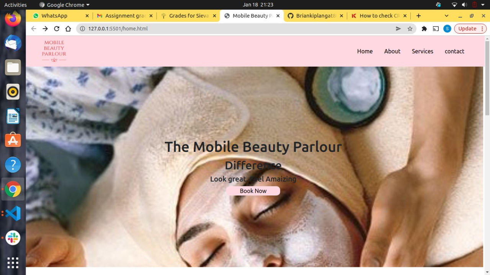

# Delani

## Author

[Melonie Langat](https://github.com/Mel-001)
[Brian Kiplangat](https://github.com/Mel-001)
[Sieva Musyoka](https://github.com/Mel-001)
[Felix Kurgat](https://github.com/Mel-001)

## Description
Mobile Beauty Parlour is a project that was made to practice Java Script, Bootstrap and JQuery learnt during the last course. Languages used are HTML and CSS incorporating the frameworks mentioned.


## Screenshot


## Live Page


## Installation / Setup instruction
* Open Terminal {Ctrl+Alt+T}

* git clone ``````

* cd Mobile Beauty Parlour

* code . or atom . depending on the text editor of your choise.

## Technologies Used

* [HTML5](https://github.com/topics/html5)
* [CSS](https://github.com/topics/css3)
* [JavaScript](https://github.com/topics/JS)
* [Bootstrap](https://github.com/topics/bootstrap)
* [jQuery](https://github.com/topics/javascript)
* markdown


## Known Bugs
* The site is not responsive enough for some devices. 
* mail chimp API does not function properly.

## Contact Information 

If you have any question or contributions, please email me at [melonielangat@gmail.com]

## License
* *MIT License:*
* Copyright (c) 2021  **Melonie Langat** **Brian Kiplangat** **Sieva Musyoka** **Felix Kurgat**